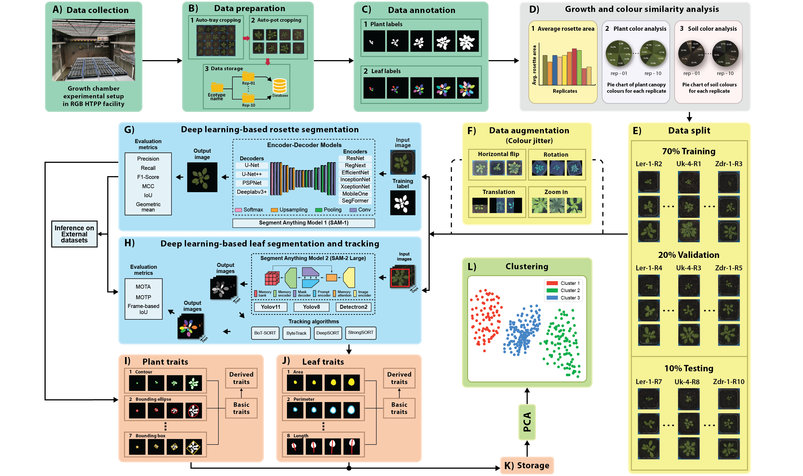

# Computer-based Recognition of Arabidopsis thaliana Ecotypes

This repository provides the full source code developed to classify various A. thaliana ecotypes using an RGB image analysis pipeline. This pipeline operates with a large volume of data collected by an X-Y indoor HTPP system...


## Description

The RGB image analysis pipeline consists of several elements (see Figure 1):
A – Collection of RGB image data in an indoor HTPP environment, B – Preparation and organization of the data using auto-pot and auto-cropping procedures, C – Assessment of complexity (variability) within generated datasets, D – Data re-definition sub-component composed of GUI-based image processing and three levels of transformation, E – Partitioning data into training, validation, and test sets, F – Data augmentation using random affine transformations, G – Auto-optimization sub-system that performs single-image and sequence-of-images classification, H – Storage of the best-performing deep learning models, I –Inferencing on test data as well as J – externally sourced data,  K – Visualization of critical regions using heat and saliency maps.



**Figure 1**. The complete workflow of the developed RGB image analysis pipeline for the recognition of various Arabidopsis ecotypes.

## Requirements
- [python>=3.7](https://www.python.org/downloads/)
- [torch>=1.4](https://pytorch.org/get-started/locally/)
- [matplotlib](https://pypi.org/project/matplotlib/)
- [numpy](https://pypi.org/project/numpy/)
- [pandas](https://pypi.org/project/pandas/)
- [pillow](https://pypi.org/project/pillow/)
- [opencv-python](https://pypi.org/project/opencv-python/)
- [scikit-learn](https://pypi.org/project/scikit-learn/)
- [jupyter notebook](https://jupyter.org/)
- [Microsoft Visual Studio >=2022](https://visualstudio.microsoft.com/vs/)

## Structure
The fundamental filesystem structure resembles the tree shown below. Essentially, we have two main folders: ```code```.
```
code
├───01_colour_n_area_analysis
│   ├───01_pre_processing
│   └───02_example_output
│
├───02_rosette_segmentation
│    ├───01_encoder_decoder_models_training.ipynb
│    ├───02_EDC_model_mask_generation.ipynb
│    ├───03_SAM_fine_tuning.ipynb
│    └───04_SAM_mask_generation.ipynb
│
├───03_leaf_segmentation_n_tracking
│   ├───01_train_instance_segmentation.ipynb
│   └───02_inference_tracking.ipynb
│   
├───04_GUI_based_plant_triats_extraction
│   ├───bin
│   │   └───Release
│   └───Properties
│
├───05_leaf_traits_extraction
│    └───01_leaf_traits_calcualtion.ipynb
│
└───06_clustering
    ├───01_plant_datastes_clust1.py
    └───02_leaf_datasets_clust1.py
```

## How to use
### Prerequisites
Each folder contains code for each task. Please go into each folder to find the required packages and install them before running the code. We recommend using [Conda](https://conda.io/projects/conda/en/latest/user-guide/install/index.html) to manage the environments better.
```
conda create -n env_name 
conda activate env_name
pip install -f requirements.txt
```

## LICENSE
This repo is distributed under [LICENSE](LICENSE).
