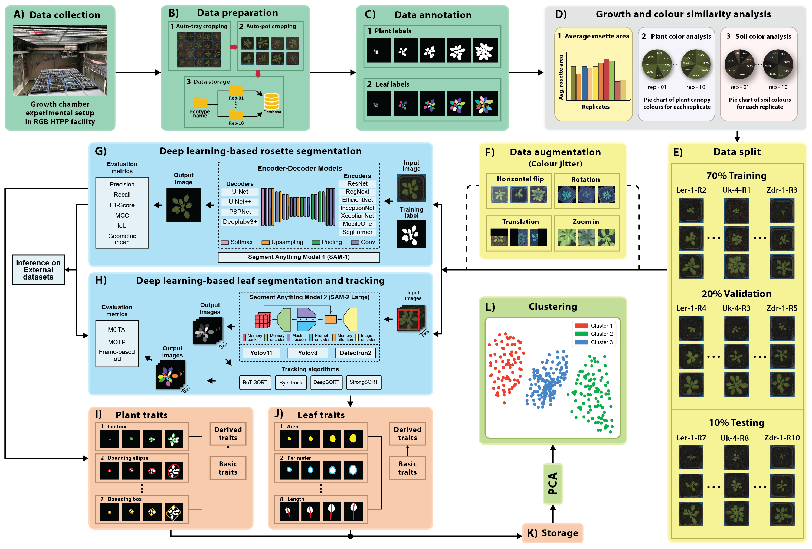

# Computer Vision Pipeline for Quantitative Analysis of Morphological Traits in _Arabidopsis thaliana_ using RGB images

This repository provides the full source code used for the development of an RGB-based image pipeline for the extraction and analysis of morphological traits in A. thaliana at both the rosette and leaf levels.


## Description   

The RGB image analysis pipeline consists of several elements (see Figure 1): 
A – Data collection; B – Data preparation using auto-tray and auto-pot cropping; C – Annotation of whole plant canopies and individual leaves; D – Analysis of ecotype replicates based on growth and plant/soil colour distribution; E – Data splitting; F – Data augmentation based on affine transformations and colour jittering; G – Deep Learning-based rosette segmentation; H – Deep learning-based leaf segmentation and tracking; I – Example of basic geometrical plant traits used to calculate basic and derived numerical traits; J – Example of basic geometrical leaf traits used to calculate basic and derived numerical traits; K – Storage of extracted numerical plant- and leaf- level traits for each dataset; L – K-means clustering on the PCA-transformed datasets. 



**Figure 1**. The complete workflow of the developed RGB image analysis pipeline for extracting and analysing various morphological traits of _A. thaliana_ plants

## Requirements
- [python>=3.7](https://www.python.org/downloads/)
- [torch>=1.4](https://pytorch.org/get-started/locally/)
- [matplotlib](https://pypi.org/project/matplotlib/)
- [numpy](https://pypi.org/project/numpy/)
- [pandas](https://pypi.org/project/pandas/)
- [pillow](https://pypi.org/project/pillow/)
- [opencv-python](https://pypi.org/project/opencv-python/)
- [scikit-learn](https://pypi.org/project/scikit-learn/)
- [jupyter notebook](https://jupyter.org/)
- [Microsoft Visual Studio >=2022](https://visualstudio.microsoft.com/vs/)

## Structure
The fundamental filesystem structure resembles the tree shown below. Essentially, we have two main folders: ```code```.
```console
code
├───01_colour_n_area_analysis
│   ├───01_pre_processing
│   └───02_example_output
│
├───02_rosette_segmentation
│    ├───01_encoder_decoder_models_training.ipynb
│    ├───02_EDC_model_mask_generation.ipynb
│    ├───03_SAM_fine_tuning.ipynb
│    └───04_SAM_mask_generation.ipynb
│
├───03_leaf_segmentation_n_tracking
│   ├───01_train_instance_segmentation.ipynb
│   └───02_inference_tracking.ipynb
│   
├───04_GUI_based_plant_triats_extraction
│   ├───bin
│   │   └───Release
│   └───Properties
│
├───05_leaf_traits_extraction
│    ├───01_leaf_traits_calculations.ipynb
│    ├───02_calculated_leaf_tratis_plots.ipynb
│    └───03_leaf_excel_data.ipynb
│
└───06_clustering
    ├───01_plant_datastes_clust1.py
    └───02_leaf_datasets_clust1.py
```

## How to use
### Prerequisites
Each folder contains code for each task. Please go into each folder to find the required packages and install them before running the code. We recommend using [Conda](https://conda.io/projects/conda/en/latest/user-guide/install/index.html) to manage the environments better.
```
conda create -n env_name 
conda activate env_name
pip install -f requirements.txt
```

## LICENSE
This repo is distributed under [LICENSE](LICENSE).
